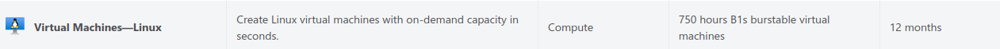

# Личный shadowsocks+v2ray сервер для обхода блокировок

Цель: открыть заблокированные провайдером сайты;

Примерное время: 30 минут;

Стоимость: бесплатно;

Что надо делать: нажимать кнопки, копировать и вставлять текст, читать простые слова на английском.

Project V - набор инструментов, которые помогут обойти замедление или полную блокировку сайтов. Он разработан азиатскими гениями для обхода великого китайского фаервола.

- Обход замедлений и блокировок
- Скрытие IP адреса
- В сравнении с VPN:
    - Незаметен для провайдера
    - Меньше просадки по скорости
    - Меньше расход аккумулятора на мобильных устройствах\
    

Конечно, всё это не приходит так просто. При установке вручную нужно выполнить несколько действий:

- Аренда сервера
- Регистрация домена
- Получение SSL сертификата
- Настройка Nginx
- Настройка Shadowsocks сервера
- Настройка клиента

В этом руководстве я расскажу, как сократить этот список и упростить действия, чтобы они были доступны энтузиасту с минимальными знаниями в айти.

Мы будем разворачивать собственный сервер на бесплатных мощностях с использованием скрипта для автоматического деплоя. 

# Подготовка

Для деплоя на сервер вам понадобится установить python3.7 на свой компьютер. У маководов и линуксоидов питон установлен из коробки, и всё должно завестись сразу. [Если нет, вот тут есть инструкция по установке](https://github.com/USATUKirill96/shadowsocks-vray-playbooks#pre-setup)

# Регистрируемся



Для примера воспользуемся сервером Microsoft Azure. Панель управления интуитивно понятна, регистрация проста, а при создании сервера мы сразу получаем доменное имя для него.

Сервис бесплатно предоставляет виртуальную машину под управлением Linux на год. 750 часов в месяц хватит для бесперебойной работы сервера. Учтите, что объем трафика на бесплатном лимите ограничен 15 гигабайтами в месяц. Бесплатные сервера устанавливают достаточно жесткие лимиты, и вы можете по аналогии с этим руководством завести еще пару серверов на других ресурсах: амазон, гугл и оракл.


[Переходим по ссылке](https://azure.microsoft.com/en-us/get-started/services/virtual-machines/)
Жмем Continue to Azure portal, проходим регистрацию, заполняем поля. В процессе потребуется привязать карту, с неё спишут и сразу вернут 70 рублей. Используйте виртуальную карту qiwi или тинькофф, чтобы не нарваться на неожиданное списание.

# Создаем сервер


После регистрации переходим [по ссылке](https://portal.azure.com/#home)

И среди сервисов выбираем virtual machines


В углу списка нажимаем Create, нас переводят на страницу выбора параметров машины. Далее настроим её, чтобы пользоваться бесплатно. В окне настройки есть несколько вкладок, нас в первую очередь интересуют Basics, Disk и Networking


## Basics

Примечание: здесь и далее пометка (free services eligible) означает доступность для бесплатного использования


- Имя виртуальной машины - ставим любое
- В качестве региона выберите один из доступных для бесплатного использования. Учтите, что в регионе может не быть бесплатных машин, и придется попробовать с другим.
- Image - Ubuntu Server 20.04 LTS
- Size - Standart_B1s


При выборе размера B1s может не быть в списке. Нажмите `See all sizes` , отключите группировку в правом верхнем углу и поставьте сортировку по стоимости. Он будет в самом начале с пометкой free services eligible


- Способ аутентификации - SSH public key
    
    
    
- Username - выставляем любой, запомните - пригодится вдальнейшем
- SSH public key source - тут возможны два варианта:
    - Use existing public key если у вас уже есть сгенерированный ключ
    - Generate new key pair если вы не знаете, что это такое. Можете задать любое имя для ключа
    
    
    

## Disk


- OS disk size - выставляем 64 гигабайта

## Networking


- Select inbound ports - включаем 80, 443 и 22 порты

## Завершение настройки

После этого можете нажать `review+create`. Вас перекинет на страницу со статусом создания виртуальной машины. Если ранее вы выбрали генерацию ssh ключа, сайт предложит сохранить его. Сохраните на компьютер, он понадобится позже.


После появления надписи Your deployment is complete, можно перейти к странице со статусом созданной виртуальной машины. Жмём Go to resource


Здесь нас интересует строка DNS name в правой колонке, раздел networking. Жмём configure


- Выставляем DNS name label. Пусть это будет не слишком подозрительное название - “мир рыбалки” или “кот сегодняшнего дня” вполне подойдет
- IP address assignment - static

Настройка завершена. Вернитесь на предыдущий экран со статусом сервера и скопируйте DNS name, оно понадобится дальше.

# Настройка проксирования

## Скачиваем проект и задаем настройки для сервера

 [Качаем проект из репозитория на гитхабе.](https://github.com/USATUKirill96/shadowsocks-vray-playbooks)

Если у вас не установлен локально git, можете скачать архив и разархивировать в удобное место


Открываем папку с проектом shadowsocks-vray-playbooks. Все дальнейшие команды будут выполняться в терминале внутри неё.

- Для windows: в папке shadowsocks-vray-playbooks зажмите шифт и нажмите правую кнопку мыши. Выберите пункт “Открыть окно PowerShell здесь”
- Для linux: ПКМ → open in terminal

Введите в терминал следующие команды:

```jsx
python3 -m pip install virtualenv
python3 -m virtualenv venv
source venv/bin/acvtivate
pip install -r requirements.txt
```

Если в будущем вы захотите поднять сервер на другой машине, нужно будет активировать виртуальное окружение через `source venv/bin/activate`

В папке *deploy* вы найдете файл `hosts.example.ini` скопируйте его и переименуйте в `hosts.ini`, замените в нем значения на следующие

```bash
server ansible_host=DNS name, которое вы задавали на последнем этапе настройки сервера
```

 


В папке с прокетом вы найдете файл `variables.example.yml` скопируйте его и переименуйте в `variables.yml`, замените в нем значения на следующие:

```yaml
user: Имя пользователя на сервере - то что вы писали в Username при настройке сервера
host: Домен,оформленный для сервера (DNS name)
email: Ваша электронная почта
proxy_password: Пароль для доступа к прокси, поставьте что-то сложное
method: Оставить как в примере
local_port: Порт, на котором будет работать ваш локальный сервер. Можно оставить как в примере
fast_open: Оставить как в примере
endpoint: эндпоинт для прокси. Можно поставить что-то наименее подозрительное для провайдера или оставить как в примере
enable_firewall: yes для включения фаервола после стартовой настройки. Если на сервере уже есть ваши проекты, и вы не знаете для чего это, включение может вызвать ошибки в их работе
```


Если при создании сервера вы выбрали  *Generate new key pair:*

1.  скопируйте скачанный ключ в текущую папку, а в *variables.yml* допишите строку

```yaml
ansible_ssh_private_key_file: имя загруженного ключа (напр. key.pem)
```

1. Введите в терминале

```bash
ansible-playbook -i inventories/hosts.ini --extra-vars "@variables.yml"  deploy/client.yml --tags prepare_ssh
```

## Выгружаем прокси сервер

Введите в терминале последовательно следующие команды:

Настройка окружения виртуальной машины

```bash
ansible-playbook -i inventories/hosts.ini --extra-vars "@variables.yml"  deploy/setup.yml
```

Если это новый сервер, и на нем нет ваших проектов, введите следующую команду чтобы очистить iptables

```bash
ansible-playbook -i inventories/hosts.ini --extra-vars "@variables.yml"  deploy/setup.yml --tags disable-iptables
```

Выгрузка сервера. Если на этом этапе падают ошибки, проверьте, правильно ли вы заполнили variables.yml

```bash
ansible-playbook -i inventories/hosts.ini --extra-vars "@variables.yml"  deploy/server.yml
```

Генерация конфигов для клиента

```bash
ansible-playbook -i inventories/hosts.ini --extra-vars "@variables.yml"  deploy/client.yml
```

# Пользуемся твиттором

В директории с проектом появилась папка client-config. В ней вы найдете shadowsocks-libev.json конфиги для десктопного клиента, а также qr код для мобильного телефона.

**Для десктопных клиентов включите переадресацию трафика из браузера на локальный сервер**

firefox: settings → general → network settings


## Ios

[Shadowrocket](https://apps.apple.com/us/app/shadowrocket/id932747118) стоит 3$. Открываем, нажимаем иконку скана, сканируем qr код, пользуемся

## Android

Нужно установить shadowsocks client и v2ray плагин к нему

- [Клиент](https://play.google.com/store/apps/details?id=com.github.shadowsocks&hl=en_US&gl=US)
- [Плагин](https://play.google.com/store/apps/details?id=com.github.shadowsocks.plugin.v2ray&hl=en_US&gl=US)

Открываем клиент, нажимаем иконку скана, сканируем qr код, пользуемся

# Ubuntu linux

- Выполните в терминале команды для установки клиентского приложения и плагина:

```
sudo apt update
sudo apt install shadowsocks-libev
sudo apt install shadowsocks-v2ray-plugin
```

- Скопируйте клиентский конфиг в папку с конфигом ss-client: `cp client-config/shadowsocks-libev.json /etc/shadowsocks-libev/config.json`
- Запустите сервер командой `ss-local`

# Windows

- Скачайте последнюю версию [shadowsocks](https://github.com/shadowsocks/shadowsocks-windows/releases) и распакуйте архив
- Скачайте последнюю версию [v2ray](https://github.com/shadowsocks/v2ray-plugin/releases) распакуйте архив, переименуйте файл внутри в v2ray.exe и сохраните в папку с shadowsocks
- Запустите Shadowsocks.exe, заполните поля как в конфиге client-config/shadowsocks-libev.json или импортируйте из него настройки